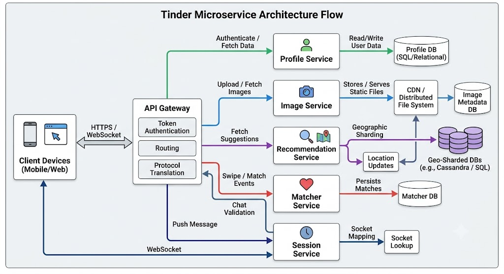

# System Design: Tinder Microservice Architecture

### 1. Requirements & High-Level Strategy

#### Feature Scoping (Front-to-Back Approach)
Instead of starting with an abstract entity-relationship (ER) diagram, design from the client feature set backward to keep the service boundaries flexible:
1. **User Profiles & Images:** Support user profiles containing textual metadata and up to 5 images per profile.
2. **Recommendation Engine:** Suggest potential matches based on location proximity, age, and gender preferences.
3. **Match Tracking:** Record bidirectional "swipes" and persist confirmed mutual matches.
4. **Direct Messaging (Chat):** Enable 1-on-1 real-time messaging between matched users.

---

### 2. Deep Dive into System Features & Services

#### 1. Profile & Image Management
* **File vs. BLOB Storage:** Storing images inside a relational database as Binary Large Objects (BLOBs) is inefficient. Databases add unnecessary overhead like transaction ACID guarantees, row mutability, and search indexing—none of which apply to static image files. 
* **Storage Architecture:** Images are stored as immutable files in a **Distributed File System** (e.g., AWS S3). The relational database stores only metadata and the file references (image URLs).
* **CDN Caching:** Because profile photos are static, image delivery is offloaded to a **Content Delivery Network (CDN)** for fast, low-latency global delivery.

#### 2. Gateway & Authentication Service
* **API Gateway Pattern:** Clients interact exclusively with an API Gateway rather than talking directly to underlying microservices.
* **Token Authentication:** The Gateway validates user request tokens against the core Profile Service. If authenticated, it routes the payload to the downstream target service (e.g., Image Service, Matcher Service). This decouples authorization logic across microservices and supports protocol translation.

#### 3. Real-time Direct Messaging (Chat Architecture)
* **Protocol Choice (HTTP vs. XMPP/WebSockets):** Standard HTTP `GET`/`POST` requests are request-response driven; clients would have to continuously poll the server for new messages, which is resource-intensive. Instead, real-time chat utilizes bidirectional protocols like **XMPP** or **WebSockets over persistent TCP connections** to push messages instantly to end devices.
* **Session Service:** Decouples connection management from the API Gateway. The Session Service tracks active user sessions by maintaining a mapping of `User ID ➔ Active Connection Socket ID`.
* **Chat Validation Flow:**
  1. User A sends a message targeted at User B to the Gateway.
  2. The Gateway checks with the **Matcher Service** to confirm that User A and User B are valid mutual matches.
  3. Once validated, the Gateway queries the **Session Service** to retrieve User B's connection socket.
  4. The message is pushed across the active TCP connection to User B.

#### 4. Matcher Service & Client Storage
* **Data Storage:** The Matcher Service manages a database mapping `User A ID ➔ User B ID` for confirmed matches, utilizing secondary indexes for fast lookup.
* **Offloading Client Interactions:** Unmatched swipes (swiping left or right) do not necessarily need real-time backend persistence on every single gesture. Swipe state can be tracked locally on the user's mobile device and synced to the server upon matching. If a user uninstalls the app, losing temporary swipe state is acceptable since re-evaluating candidate profiles does not break the core user experience.

#### 5. Recommendation Engine & Location Proximity
* **The Multi-Index Query Problem:** Recommending candidate profiles requires querying three primary dimensions: **Age**, **Gender**, and **Location**. Standard relational databases struggle with multi-column range queries because query optimizers typically execute searches using only a single index at a time.
* **Geographic Sharding (Horizontal Partitioning):** 
  * The dataset is horizontally partitioned (sharded) based on **Geographic Chunks / Quadrants**.
  * Each database shard contains candidate data strictly for a specific location boundary.
  * Within that localized shard, candidate rows are indexed by age, and gender filtering is applied to the retrieved subset.
* **NoSQL Alternative:** High-throughput NoSQL engines (e.g., Apache Cassandra or Amazon DynamoDB) can handle multi-dimensional queries by replicating dataset views across secondary tables optimized for distinct query keys.
* **Location Updates:** The client app pushes background location updates to the Recommendation Service periodically (e.g., every 1–2 hours) to keep proximity searches accurate.
